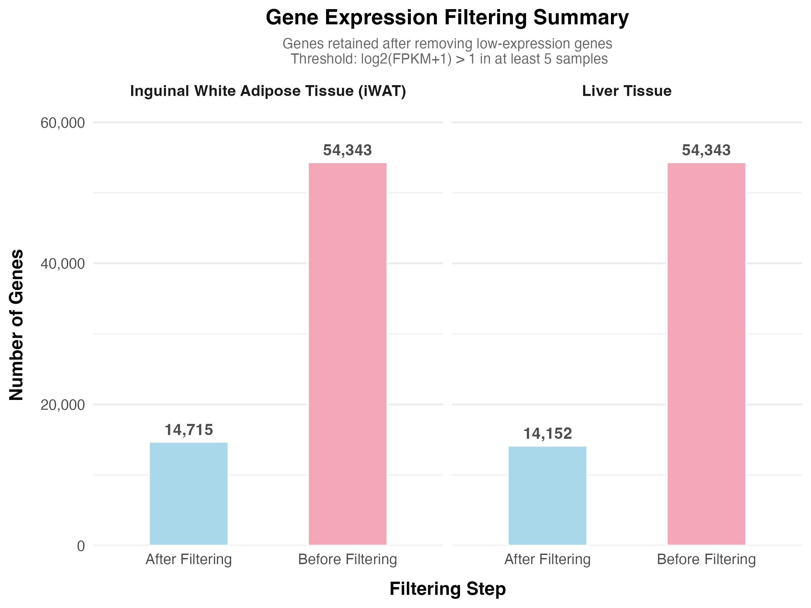
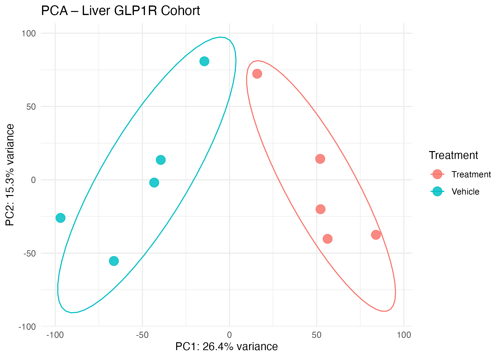
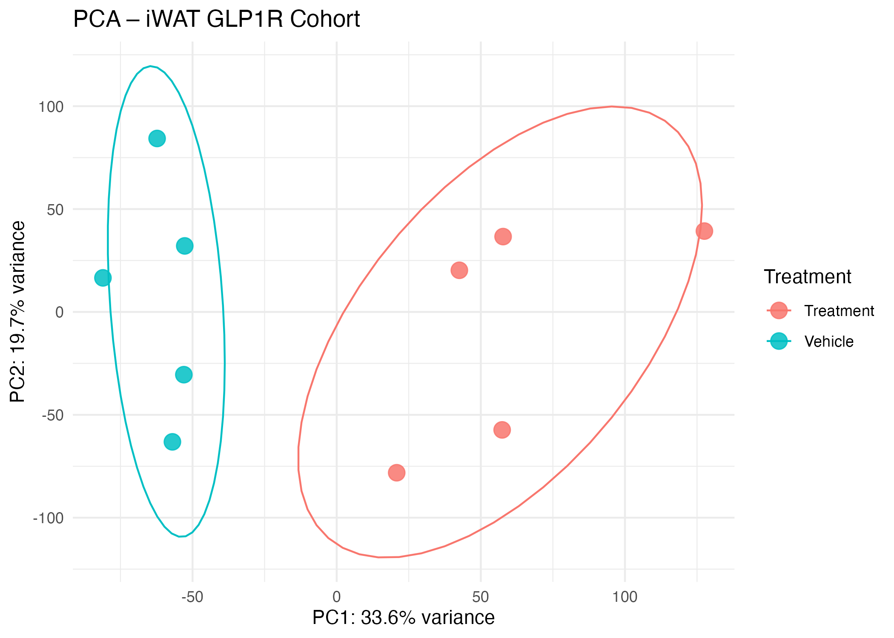
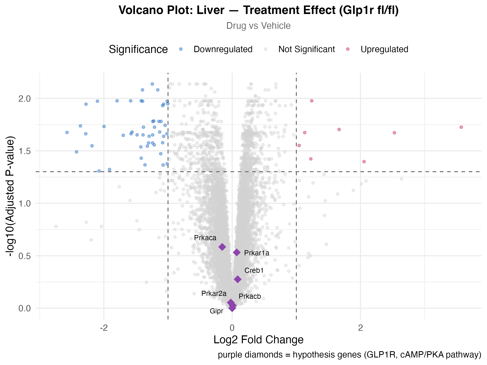
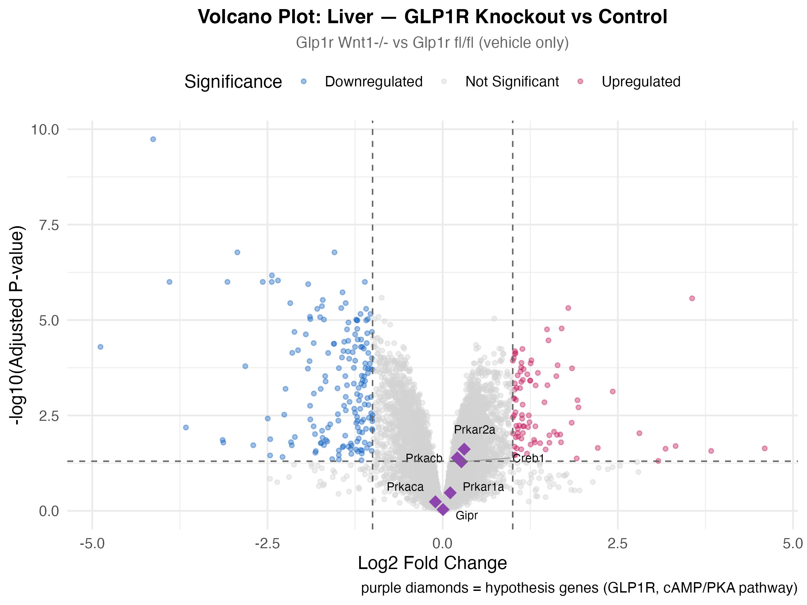
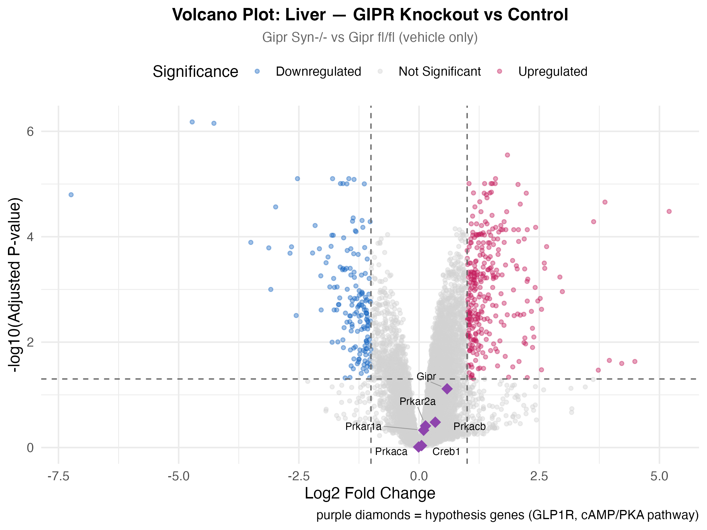
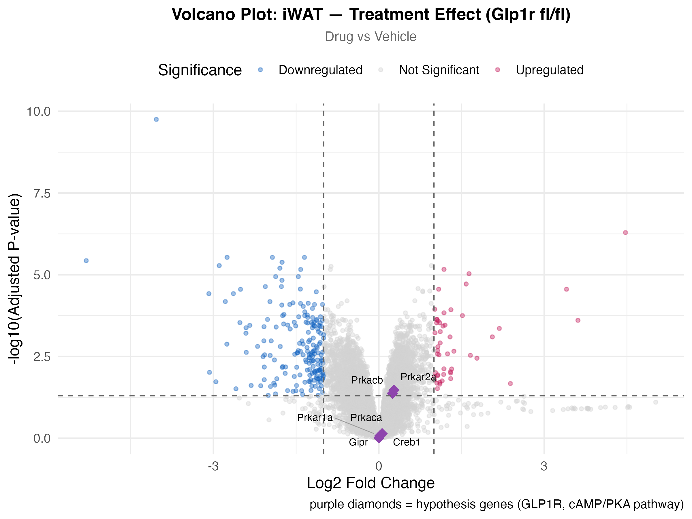
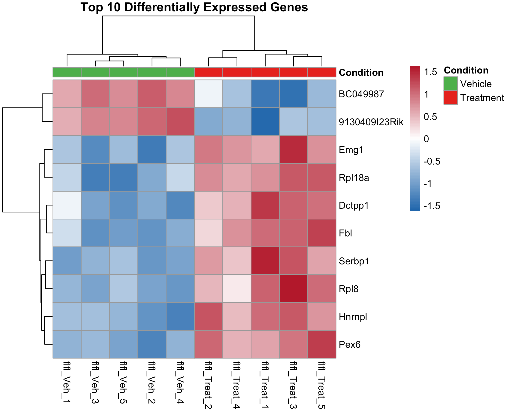
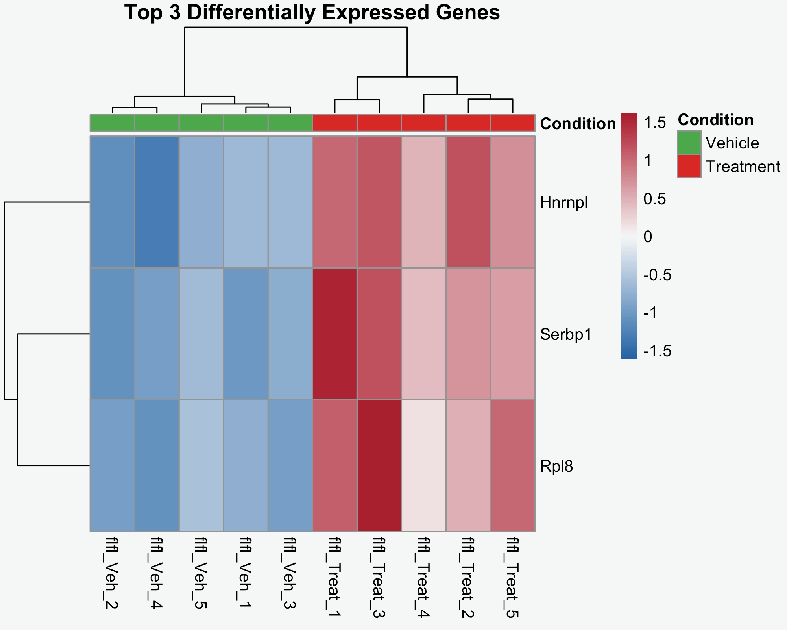

---
title: "Results"

This page presents all figures generated from our differential expression
analysis pipeline. Each figure is organized by the question it answers,
with a short interpretation underneath.

## Quality Control

### Gene Filtering Summary

Before running any statistics we filtered 54,343 genes down to the ones
that were actively expressed across our samples.

- Liver: 14,152 genes retained
- iWAT: 14,715 genes retained
- Genes removed had expression near zero across all samples and would
  have added noise to the analysis

### PCA — Liver and iWAT GLP1R Cohort

PCA confirmed that treated and vehicle samples separate into distinct
clusters in both tissues. The iWAT separation was more distinct than
liver, suggesting treatment has a stronger global effect on gene
expression in fat tissue. This validated our dataset before running
differential expression.

:::: {.columns}
::: {.column width="50%"}
**Liver GLP1R Cohort**
PC1: 26.4% variance | PC2: 15.3% variance

:::

::: {.column width="50%"}
**iWAT GLP1R Cohort**
PC1: 33.6% variance | PC2: 19.7% variance

:::
::::

## Differential Expression

### Volcano Plot 1 — Liver Treatment Effect

**Question:** Does the drug change gene expression in liver?

**Result:** 8 genes upregulated, 49 downregulated. Modest response.
cAMP/PKA hypothesis genes did not reach significance, clustering near
zero fold change. The drug is having a real but subtle effect in liver.

### Volcano Plot 2 — GLP1R Knockout vs Control in Liver

**Question:** What happens when GLP-1R is removed from CNS neurons?

**Result:** 87 genes upregulated, 173 downregulated. Far more changes
than drug treatment alone. Prkar2a and Prkacb trending close to
significance (p = 0.024 and 0.041), suggesting the cAMP/PKA pathway
responds when GLP-1R signaling is eliminated.

### Volcano Plot 3 — GIPR Knockout vs Control in Liver

**Question:** What happens when GIPR is removed from CNS neurons?

**Result:** 299 genes upregulated, 161 downregulated. The largest
response across all four comparisons. This was our most unexpected
finding — GIPR deletion affected liver gene expression more broadly
than GLP-1R deletion, pointing to an important brain-liver axis
through GIPR.

### Volcano Plot 4 — iWAT Treatment Effect

**Question:** Does the drug affect fat tissue differently than liver?

**Result:** 49 genes upregulated, 192 downregulated. Stronger than
liver. Prkar2a and Prkacb trending at p = 0.034 and 0.042 — the
same cAMP/PKA genes that appeared in the GLP1R knockout comparison,
suggesting a consistent but subtle biological signal.

## Heatmap

### Top 10 Differentially Expressed Genes

The heatmap shows the top 10 most significantly changed genes from
the liver treatment comparison. Treated and vehicle samples cluster
on opposite sides, visually confirming the drug produces a consistent
and reproducible pattern of gene expression changes across all samples.

### Top 3 Most Significant Genes

This heatmap focuses on the three most significantly differentially expressed
genes from the liver treatment comparison. The pattern of expression across
treated and vehicle samples is even clearer here, confirming these genes are
the strongest and most consistent responders to the drug treatment.

### Top 3 Most Significant Genes

This heatmap focuses on the three most significantly differentially expressed
genes from the liver treatment comparison. The pattern of expression across
treated and vehicle samples is even clearer here, confirming that these genes
are the strongest and most consistent responders to the drug treatment.

## Synthesis

Across all figures, the key findings are:

- The drug is having a real biological effect confirmed by PCA separation
  and heatmap clustering
- cAMP/PKA pathway genes trend in the predicted direction but do not
  cross our significance threshold
- Fat tissue responds more strongly to treatment than liver
- GIPR deletion in the CNS produces the largest transcriptional changes
  of any comparison, pointing to a brain-liver axis through GIPR that
  was not part of our original hypothesis

Our hypothesis is partially supported. The direction of change is
consistent with our predictions but the magnitude is more subtle than
expected, and GIPR emerged as an equally important regulatory system
alongside GLP-1R.
